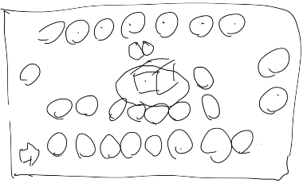
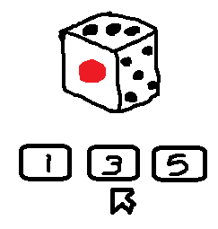

# 海賊すごろく開発企画書

Copyright (C) 2022 たなかゆう

---

## 海賊すごろくとは
マスを破壊したり、追加したり、ランダムにシャッフルしたりと変化するコースで金貨集めを競うすごろくです。

## 基本情報
- プレイ人数：4名(プレイヤーがいない場合はNPC)
- 動作環境　：WebGL, Windows, mac
- 画面解像度：960x540ピクセル

## 操作方法
マウスで操作します。

- 手番になったら画面をクリックするとサイコロを振ります
- サイコロの３つの面の目から一つをボタンをクリックして選びます
- メッセージはマウスクリックで進めることができます
- タイトル画面でESCキーで終了します(WebGLはなし)

## ルール
- サイコロを振って出た３つの目から好きな数を選んで進みます
- 止まったタルに開けていない宝箱があれば中身をゲット、仕掛けがあれば作動させます
- 宝箱には金貨やアイテムが入っています
- 仕掛けの影響で、金貨を没収されることがあります。金貨はゴールにストックされます
- 誰か一人がゴールに着くとゲーム終了です
- 最初にゴールしたプレイヤーに、ゴールにストックされていた金貨が与えられます
- ゲーム終了時の金貨の所有数で順位が決まります

## 売り
３つの目から進める数を選べることと、コースが変わることでゲームの展開を一変させるギャンブル性の高さです。

自分もリスクを追う代わりに対戦相手を道連れにして、ゲームを引っ掻き回す一発逆転が味わえるパーティゲームです。

## フィーチャーセット

- 仕掛け
  - 指定のタルへジャンプ
  - 検問
    - 通行料を払う。通行料は通過するごとに安くなる
    - 通行料が足りない場合は休み
    - 休んだ場合、次のターンでサイコロを振って、出目で通行料の不足分を支払う。足りなければもう一回休み
    - 通行証を持っていると無料で通り抜けられる
  - 大砲
    - ランダムにタルを破壊
    - 破壊されたタルに乗っていたプレイヤーは金貨を半額没収されてスタートに戻される
    - 浮き輪を持っていたら一つ手前のタルに泳ぎついて被害なし
  - レバー
    - タルを追加して、新しい宝箱が得られる
    - 初期のタルの数から4つまで増やせる。それ以上は効果なし
  - フルシャッフル
    - 全てのタルの位置をランダムに並び替え
    - 移動後の仕掛けは動かさない
- アイテム
  - 通行証
    - 検問で通行料を支払わずに通り抜けられる
    - 使用したらなくなる
  - 浮き輪
    - 大砲を食らっても、一つ手前のタルに泳ぎついてセーフになる
    - 使用したらなくなる
